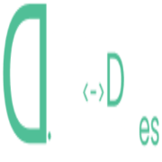
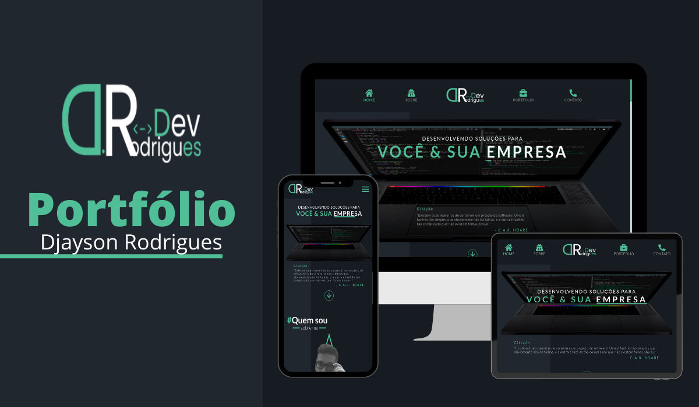

<p align="center">
       
</p>
<h1 align="center"> 
DJAYSONRODRIGUES-PORTFOLIO <br>
| 😎 | 
</h1>

## 💻 Project

The **DjaysonRodrigues-Portfolio** consists of a personal website that demonstrates my projects and services that I have developed as a programmer.

<br>

<p align="center">
    
</p>

## 🚀 Technologies

- Nextjs
- TypeScript
- React
- React-icons
- React-slick
- slick-carousel
- Polished
- CMS-Prismicio
- axios
- nodemailer
- nodemailer-sendgrid-transport
- Styled-components

## ℹ️ How to Execute

- ### **Preconditions**
  - You must have Node.js installed on your computer.
  - You must have Git installed and configured on your computer.
  - Also, you need to have a package manager, either NPM or Yarn.

1. Make a clone of the repository:

```sh
  $ git clone https://github.com/Djaysson/DjaysonRodrigues-Portfolio.git
```

2. Application Execution:

```sh
  # Go to the project folder.
  $ cd DjaysonRodrigues-Portfolio
  # Installing the project dependencies.
  $ yarn install # or npm install
  # Run the app
  $ yarn start # or npm start
```

Made by Djayson Rodrigues 👋 [Linkedin](https://www.linkedin.com/in/djaysonrodrigues/)
